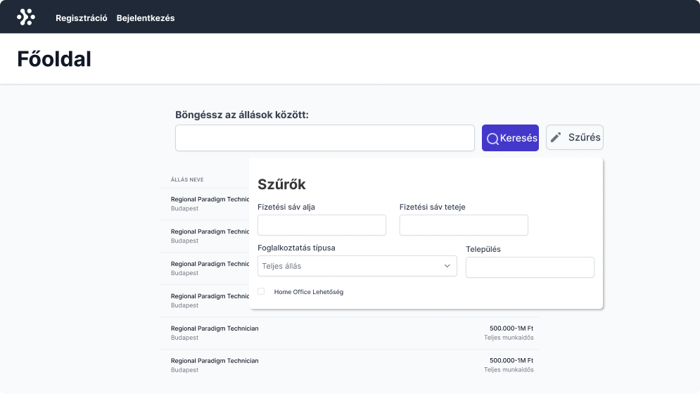
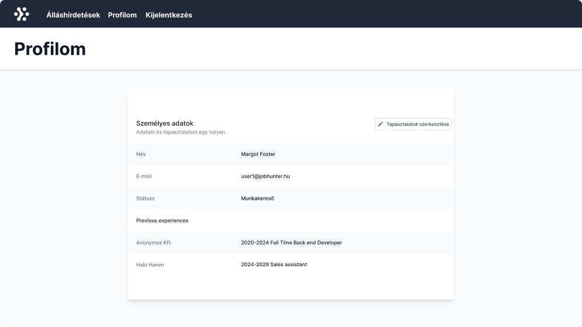
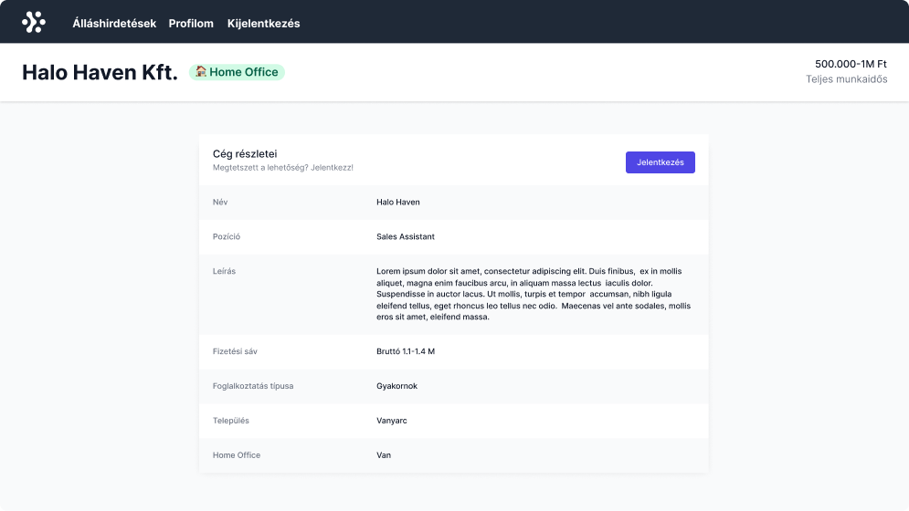
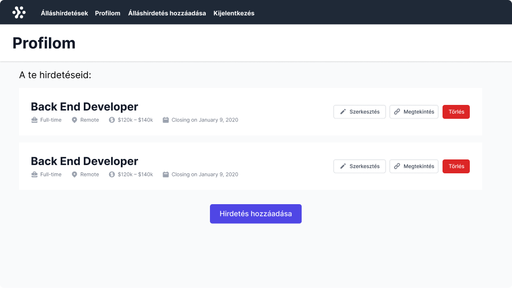

## **A feladat leírása**

A feladat egy álláskereső oldal létrehozása, ami segíti a felhasználókat a munkakeresésben. A weboldalra kétféle felhasználót tudunk regisztrálni: **munkavállalót**, vagy **munkáltatót**. Mindkét szerepkör más-más funkciókat ér el.

A feladatot *React* és *Redux* kombinációjával kell megoldanod. Redux esetében ajánlott a *redux toolkit* és akár az *RTK Query* használata. Mivel az alkalmazás több oldalból áll, a *react-router* használata javasolt. A feladatban adott a szerveroldali REST API, leírását lentebb olvashatjátok, ehhez kell igazodnia a kliensnek.

Ugyan segítségképp mellékeltünk egy webdesignt, **nem elvárás** a design lefejlesztése, csak útmutatásképp szolgálnak az illusztrációk.

## Navigáció

Minden oldal tetején megjelenik egy navigációs sáv, ahol az alkalmazás neve és az elérhető funkciók vannak menüpontokban megjelenítve:

- Jobhunter (ez az alkalmazás neve, rákattintva főoldalra visz)
- Ha nincs bejelentkezve
    - Főoldal - Álláshirdetések listázása
    - Regisztráció
    - Bejelentkezés
- Bejelentkezve munkavállalóként
    - Főoldal - Álláshirdetések listázása
    - Profilom - Felhasználó adatai, profil szerkesztése
    - Kijelentkezés
- Bejelentkezve munkáltatóként
    - Főoldal - Álláshirdetések listázása
    - Profilom - Kilistázva a felhasználó által meghirdetett munkalehetőségek
    - Álláshirdetés hozzáadása - Űrlap
    - Kijelentkezés

## Oldalak

### Bejelentkezés nélkül

Bejelentkezés nélkül a vendég felhasználók az alábbi oldalakat tekinthetik meg:

- Főoldal: Álláslehetőségek kilistázódnak, van egy szűrő rész, amivel szűrni tudunk a következő mezők alapján:
    - fizetési sáv
    - foglalkoztatottság típusa (full-time, part-time, internship)
    - település
    - van-e home-office lehetőség
- Bejelentkezés oldala
    - E-mail és jelszó párossal autentikálhatja magát a felhasználó
- Regisztráció oldala
    - Kiválasztható a profil típusa (Munkáltató / Munkavállaló)
    - Munkavállaló típus esetén megadhatóak a korábbi munkatapasztalatok:
        - Több-soros szöveges beviteli mezőben, amiben soronként tördelve meg tudjuk adni a munkahelyeinket és a hozzá tartozó pozíciót, illetve a tól-ig évszámot.
        
        ```json
        Halo Haven;Front-end fejlesztő;2021-2022
        Dunder Mifflin;Full-stack fejlesztő;2022-
        
        ```
        

### Munkavállalóként regisztrált felhasználó

**Oldal: Állások listázása**

- A felhasználó böngészhet az összes álláshirdetés között
- A felhasználó az alábbi tulajdonságok alapján szűrhet az ajánlatok között:
    - fizetési sáv
    - foglalkoztatottság típusa (full-time, part-time, internship)
    - település
    - van-e home-office lehetőség



**Oldal: Profil**

- A felhasználó profilján listázásra kerülnek a profilhoz tartozó adatai
- A megadott korábbi tapasztalatok szerkeszthetőek



**Oldal: Álláshirdetés adatlapja**

- Egy álláshirdetést megnyitva a felhasználó megtekintheti az álláshirdetés adatlapját
- Az álláshirdetés adatlapján bejelentkezett munkavállalónak lehetősége van jelentkezni az adott állásra



### Munkáltatóként regisztrált felhasználó

**Oldal: Profil**

- Listázásra kerülnek a munkáltató korábban hozzáadott álláshirdetései
- Az egyes listaelemekhez a következő akciók tartoznak:
    - Megtekintés - Az adott álláshirdetésre jelentkezett munkavállalók megtekintése
    - Szerkesztés
    - Törlés
- A felhasználónak lehetősége van új hirdetéseket közzétenni az itt szereplő “Hozzáadás” gomb segítségével



**Oldal: Álláshirdetés adatlapja**

- Egy álláshirdetés kapcsán a megtekintés akciót választva a felhasználó megtekintheti azon felhasználók listáját, akik jelentkeztek a hirdetésre. A felhasználók listázásra kerülnek, és megtekinthető az adatlapjuk.

**Oldal: Álláshirdetés hozzáadása, Álláshirdetés szerkesztése**

Álláshirdetés hozzáadása és szerkesztése során az alábbi tulajdonságok állíthatóak be:

- Cég neve - szöveges beviteli mező
- Pozíció neve - szöveges beviteli mező
- Leírás - Több-soros szöveges beviteli mező
- Fizetési sáv (-tól, -ig) - szám beviteli mezők (Az intervallum szélső értékeinek megadása két űrlapelem segítségével történik)
- Foglalkoztatás formája - legördülő mező. Lehetőségek:
    - Teljes állás (full-time)
    - Részmunkaidős (part-time)
    - Gyakornoki (internship)
- Település - szöveges beviteli mező
- Van-e home office lehetőség - checkbox


## **A kliens**

Az alkalmazást a `client` mappában kell elkészíteni. A mappa egyelőre egy teljesen friss Vite telepítést tartalmaz, a szükséges további függőségeket Nektek kell hozzáadni. A nem szükséges dolgokat viszont nyugodtan ki is törölheted!

```
cd client
npm install
npm run dev
```

## **REST API**

A szerver forráskódja a rest-api mappában található. Telepíteni és indítani kell lokálisan:

```
cd rest-api
npm install
npm run migrate (csak első indításnál szükséges)
npm run dev (fejlesztői kiszolgáló futtatása)
```
Négy szolgáltatás van kivezetve:

- users
- experiences
- jobs
- applicants

A végpontok leírását és kipróbálását úgy tehetitek meg legegyszerűbben, ha az alábbi Postman gyűjteményt importáljátok a Postman REST API kliensbe. Ez egy webes alkalmazás, a Postman Agentet lokálisan telepíteni kell, majd a megnyíló alkalmazásban egy új Workspace-t kell létrehozni, és fent megnyomni az "Import" gombot, és egyesével linkként beilleszteni őket:

[Minden szolgáltatás elérhető ezt a linket beillesztve](https://api.postman.com/collections/15151253-f98c9d58-a8e9-4cb4-a4c2-ba0ade3caaac?access_key=PMAT-01HXH44ZMB65PBYGK0W7WQCJSJ)


Ha el van indítva a rest-api, kipróbálhatók a végpontok. A felküldendő tartalmak a Body részben vannak előkészítve.

### users
#### register
A végpont segítségével egy felhasználót regisztrálhatunk.
A `role` mező beállításával határozható meg a regisztráció típusa. (`company`: munkáltató, `jobseeker`: munkavállaló)
#### authenticate
A végpont segítségével egy felhasználó autentikációs adatait elküldve egy `accessToken`-t kapunk vissza, amely segítségével elérhetjük azokat a végpontokat, amelyek csak bejelentkezés után érhetőek el.
#### user info
A végpont segítségével hitelesítés után lekérhetőek egy felhasználó adatai. A végpont használatához a felhasználó egyedi azonosítóját szükséges megadni.

### experiences
#### Munkavállalóként bejelentkezve:
#### get user experiences
A végpont segítségével a bejelentkezett felhasználó korábbi tapasztalai kérhetőek le.

#### add (multiple) experience
A végpont segítségével hozzáadható egy vagy több korábbi munkatapasztalat. Ehhez a megadott formátumú objektumnak, illetve objektumok listájának elküldése szükséges.

#### modify experience
A végpont segítségével korábban felvett munkatapasztalatokat módosíthatunk az adott tapasztalat egyedi azonosítójának használatával.

#### delete experience (delete all experiences)
Törlés kérés segítségével a végponton keresztül törölhetünk egy vagy több hozzáadott munkatapasztalatot.

### jobs

####  all jobs
A végpont segítségével lekérhető az összes álláshirdetés (bejelentkezés nélkül is).

Az álláshirdetések szűrése query paramétereken keresztül történik.

(például: `?userId=1&salaryFrom[$gt]=350000&company[$like]=%miff%`)

#### Munkáltatóként bejelentkezve:

#### create job
A végpontra elküldhetünk egy álláshirdetést, hogy hozzáadjunk egy újat.

#### modify job
A végpont segítségével módosíthatunk egy álláshirdetést. A módosításhoz az álláshirdetés egyedi azonosítóját megadva kell elküldenünk az új adatokat.

#### delete job (delete all jobs)
A végponton keresztül törölhetünk egy álláshirdetést, vagy kitörölhetjük az összeset.

### applicants

#### apply for a job
Munkáltatóként bejelentkezve a végpont segítségével jelentkezhetünk egy álláshirdetésre. A kérés törzsében határozható meg az állás, amelyre a bejelentkezett felhasználóval jelentkezhetünk.

#### remove application from a job
Munkáltatóként bejelentkezve a végpont segítségével visszavonhatjuk az állásjelentkezésünket.

#### applicants for a job / jobs for an applicant
Munkáltatóként lekérhetjük az álláshirdetésünkre jelentkezett felhasználókat, munkavállalóként pedig lekérhető a bejelentkezett felhasználó összes állásjelentkezése.

